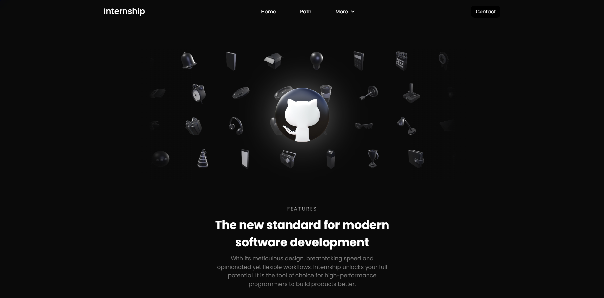

This project serves as a mockup platform for showcasing internship positions. It features a **Fake Calendar** for internship opportunities, **smooth transitions** throughout the website, and a **table with filters** for listing static student data.

## Live Preview

You can check out the live version of the mockup [here](termjs.github.io/code-academy/).

## Features
• **Fake Calendar for Internship Positions**: A mock calendar system displaying available internship slots.  
• **Smooth Transitions**: Seamless navigation with soft transitions and animations across pages.  
• **Responsiveness**: The website is fully responsive, ensuring optimal viewing and interaction across various devices and screen sizes.  
• **Interactive Carousel on Home Page**: An engaging carousel highlighting internship opportunities and academy offerings.

## Technologies Used
• **HTML/CSS**: For building the structure and applying the smooth transitions.
• **JavaScript**: Used for the interactive calendar and carousel functionality.

## To-Do List
- [x] Fix navbar
- [x] Compress images
- [x] Fix filter blur on iOS
- [x] Fix status bar color on iOS
- [x] Fix and add safe space to iOS status bar
